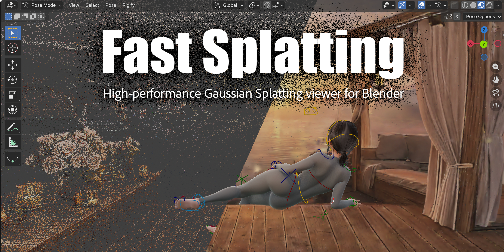

[English](README.md) | **中文**



高性能 3D 高斯泼溅查看器，内嵌于 Blender 视口中。
支持 Spark's SPZ(.spz) 文件格式 Importer。

## 功能

- **实时泼溅渲染** — 公告板泼溅，将 3D 协方差投影到屏幕空间，按正确顺序进行 Alpha 混合
- **空间块索引** — 自动网格化空间分区，实现高效视锥体裁剪，支持逐块排序实现正确透明度
- **增量式视点排序** — 检测相机移动，每帧增量地从远到近重新排序泼溅；优先处理可见块
- **色彩调整** — 实时色调、曝光度、伽马、色相偏移和饱和度控制
- **动画导出** — 将 3D 视口帧导出为 PNG 图像序列，支持逐帧排序
- **GPU 实例化** — 所有泼溅被批量打包为逐块 GPU 批次，在 CPU 上预计算 3D 协方差

## 兼容性

- Blender 4.2+
- Blender 5.0+
- macOS
- Windows
- Linux

## 安装

本插件以 Blender 扩展形式分发。

1. 下载 zip 包
2. 将 zip 拖入 Blender 视口
3. 确认安装

## 使用

### 获取泼溅数据

Fast Splatting 可处理由外部工具生成的高斯泼溅文件。

你可以通过以下方式生成泼溅：

- 腾讯混元（单图世界生成）
- 任何导出 .ply 的高斯泼溅管线
- 扫描数据（Polycam、RealityScan 等）

### 快速开始

1. **导入 PLY 模型** — `文件 → 导入 → PLY (.ply)`，选择一个高斯泼溅 PLY 文件
2. **添加导入的网格** — 在 3D 视口中选中该网格，然后在侧边栏（`N` 键 → **FastSplatting** 标签页）点击 **+** 按钮将其添加到 **Splat Meshes** 列表
3. **Start Render** — 点击 **Start Render** 初始化 GPU 缓冲区并开始渲染
4. **Stop Render** — 点击 **Stop Render** 释放 GPU 资源

- 在 MacBook Air M1 上运行1.4M 泼溅数据:


### 控件

| 控件 | 说明 |
|---|---|
| Block Size | 空间分区的网格单元大小（需重新开始渲染） |
| Tint | RGB 颜色乘数 |
| Exposure | 亮度乘数 |
| Gamma | 伽马校正 |
| Hue | 色相偏移（-1 到 1） |
| Saturation | 饱和度（0 = 灰度，1 = 原始） |
| Splat Scal | 泼溅大小的统一缩放乘数 |

### 动画导出

Fast Splatting 不支持渲染管线导出，因此如果需要导出动画，需要使用动画导出功能将视口快照为图像序列。

1. 设置**Start/End**帧范围
2. 选择**Output**目录
3. 启用**Force Sorting Every Frame**以在相机动画期间保持正确透明度
4. 点击**Export Frames**——视口进入全屏模式并导出 PNG 序列
5. 按 **Esc** 键取消操作

### 统计信息

渲染时，面板会显示总块数/泼溅数和已显示的块数/泼溅数。

## 架构

```
Fast Splatting/
├── __init__.py           # 插件元数据，注册
├── operators.py          # Blender 操作符
├── panels.py             # UI 侧边栏面板，场景属性
├── splatting_data.py     # 数据加载，空间索引，状态管理，排序
├── gpu_renderer.py       # GPU 批次构建，GLSL 着色器，绘制循环
└── blender_manifest.toml # Blender 扩展清单
```

## 性能说明

- 泼溅数量和块大小决定内存和绘制调用开销。block size越大 = 块越少 = 绘制调用越少，但裁剪越粗糙
- 推荐使用少于1.5K的block数量。
- 加载后或大幅相机移动后的初始排序可能需要数帧才能收敛

## 许可证

GPL-3.0
